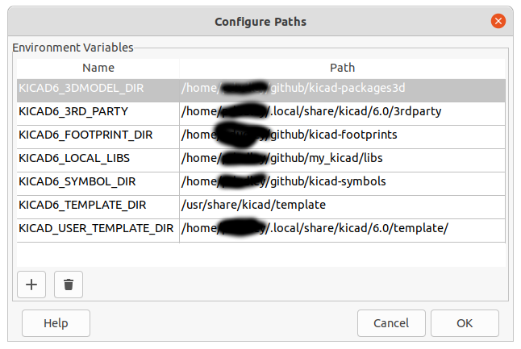

#               my_kicade

This is repo to contain some simple attempts to use Kicad 6 to design some printed circuit boards.

## File organization and version control

I like to make it so that design files are usable by just cloning them from GitHub but that is not completely possible with KiCad because libraries are external to the design folders and KiCad relies on user level pathname to access libraries.

